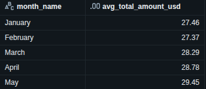
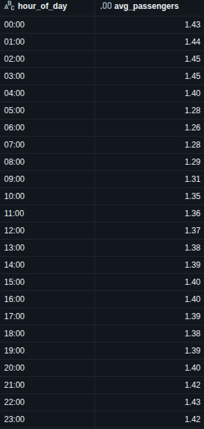

# TLC Trip Data — Pipeline Medallion

## Ordem de execução

### 1. `s3_data_ingester.py` - Execução Local

Baixa os arquivos `.parquet` da API TLC e sobe para o S3 na `landing_zone`.  
Pula arquivos que já existem no bucket.

```bash
pip install -r requirements.txt
python src/s3_data_ingester.py
```

Requer `.env` com:
```
AWS_ACCESS_KEY_ID=
AWS_SECRET_ACCESS_KEY=
AWS_DEFAULT_REGION=
```

---

### 2. `medallion_architecture_etl.py` - Notebook Databricks

Execute este notebook no Databricks Community Edition.

**Bronze**: lê cada arquivo da `landing_zone` individualmente, aplica cast das colunas com tipo conflitante entre meses e grava em parquet particionado por data de ingestão.

**Silver**: lê a pasta Bronze (uniforme após os casts), recalcula `date_partition` com a data real do pickup e grava em Delta com registro no catálogo.

**Gold**: une yellow e green, padroniza nomes de coluna, filtra registros inválidos e grava a tabela de consumo final em Delta.

---

### 3. `taxi_consumption_analysis.py` - Notebook Databricks

**Análises**
- Média de `total_amount` por mês (Yellow taxi)
- Média de passageiros por hora no mês de maio (Yellow e Green)

---

## Resultados das Análises

### Q1: Média de valor total recebido por mês (Yellow Taxi)

A média de valor total recebido por mês pelos yellow taxis ficou em torno de **$28**, com crescimento gradual de janeiro ($27.46) a maio ($29.45).



### Q2: Média de passageiros por hora em maio

A média de passageiros por hora no mês de maio variou entre **1.26 e 1.45**, com o menor volume entre 06:00 e 08:00 e leve alta na madrugada. O padrão é estável ao longo do dia, indicando predominância de corridas individuais em todos os horários.



---

## Estrutura S3

```
tlc-export-lake/
├── landing_zone/{taxi}_taxi/
├── bronze_layer/{taxi}_taxi/
├── silver_layer/{taxi}_taxi/
└── gold_layer/taxi_consumption/
```

---

## Observações

- Databricks Community Edition não permite alterar `spark.conf` conflitos de schema são resolvidos via cast explícito arquivo a arquivo na Bronze.
- `Airport_fee` (maiúsculo) presente em alguns arquivos yellow é normalizado para `airport_fee` antes da escrita.
- Tipos definidos com base na inspeção dos arquivos: janeiro/2023 chegou com tipos divergentes dos demais meses.